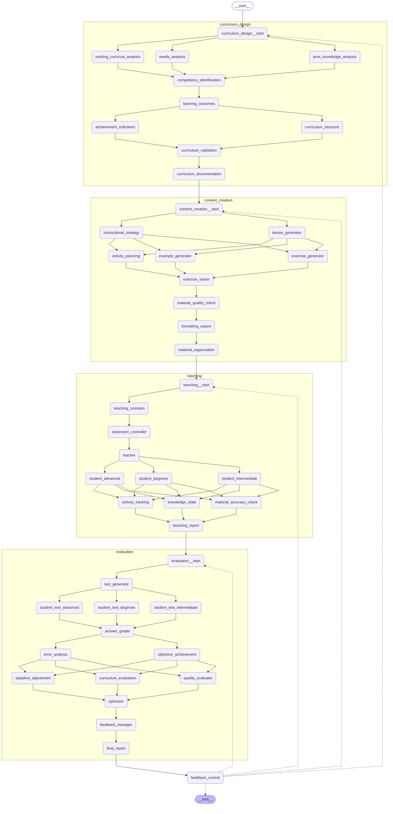

```mermaid
---
config:
  flowchart:
    curve: linear
---
graph TD;
	__start__([<p>__start__</p>]):::first
	feedback_control(feedback_control)
	__end__([<p>__end__</p>]):::last
	__start__ --> curriculum_design\3acurriculum_design__start;
	content_creation\3amaterial_organization --> teaching\3ateaching__start;
	curriculum_design\3acurriculum_documentation --> content_creation\3acontent_creation__start;
	evaluation\3afinal_report --> feedback_control;
	feedback_control -.-> __end__;
	feedback_control -.-> content_creation\3acontent_creation__start;
	feedback_control -.-> curriculum_design\3acurriculum_design__start;
	feedback_control -.-> evaluation\3aevaluation__start;
	feedback_control -.-> teaching\3ateaching__start;
	teaching\3ateaching_report --> evaluation\3aevaluation__start;
	subgraph curriculum_design
	curriculum_design\3acurriculum_design__start(curriculum_design__start)
	curriculum_design\3aneeds_analysis(needs_analysis)
	curriculum_design\3aprior_knowledge_analysis(prior_knowledge_analysis)
	curriculum_design\3aexisting_curricula_analysis(existing_curricula_analysis)
	curriculum_design\3acompetency_identification(competency_identification)
	curriculum_design\3alearning_outcomes(learning_outcomes)
	curriculum_design\3acurriculum_structure(curriculum_structure)
	curriculum_design\3aachievement_indicators(achievement_indicators)
	curriculum_design\3acurriculum_validation(curriculum_validation)
	curriculum_design\3acurriculum_documentation(curriculum_documentation)
	curriculum_design\3aachievement_indicators --> curriculum_design\3acurriculum_validation;
	curriculum_design\3acompetency_identification --> curriculum_design\3alearning_outcomes;
	curriculum_design\3acurriculum_design__start --> curriculum_design\3aexisting_curricula_analysis;
	curriculum_design\3acurriculum_design__start --> curriculum_design\3aneeds_analysis;
	curriculum_design\3acurriculum_design__start --> curriculum_design\3aprior_knowledge_analysis;
	curriculum_design\3acurriculum_structure --> curriculum_design\3acurriculum_validation;
	curriculum_design\3acurriculum_validation --> curriculum_design\3acurriculum_documentation;
	curriculum_design\3aexisting_curricula_analysis --> curriculum_design\3acompetency_identification;
	curriculum_design\3alearning_outcomes --> curriculum_design\3aachievement_indicators;
	curriculum_design\3alearning_outcomes --> curriculum_design\3acurriculum_structure;
	curriculum_design\3aneeds_analysis --> curriculum_design\3acompetency_identification;
	curriculum_design\3aprior_knowledge_analysis --> curriculum_design\3acompetency_identification;
	end
	subgraph content_creation
	content_creation\3acontent_creation__start(content_creation__start)
	content_creation\3alesson_generator(lesson_generator)
	content_creation\3ainstructional_strategy(instructional_strategy)
	content_creation\3aactivity_planning(activity_planning)
	content_creation\3aexample_generator(example_generator)
	content_creation\3aexercise_generator(exercise_generator)
	content_creation\3aexercise_solver(exercise_solver)
	content_creation\3amaterial_quality_check(material_quality_check)
	content_creation\3aformatting_export(formatting_export)
	content_creation\3amaterial_organization(material_organization)
	content_creation\3aactivity_planning --> content_creation\3aexercise_solver;
	content_creation\3acontent_creation__start --> content_creation\3ainstructional_strategy;
	content_creation\3acontent_creation__start --> content_creation\3alesson_generator;
	content_creation\3aexample_generator --> content_creation\3aexercise_solver;
	content_creation\3aexercise_generator --> content_creation\3aexercise_solver;
	content_creation\3aexercise_solver --> content_creation\3amaterial_quality_check;
	content_creation\3aformatting_export --> content_creation\3amaterial_organization;
	content_creation\3ainstructional_strategy --> content_creation\3aactivity_planning;
	content_creation\3ainstructional_strategy --> content_creation\3aexample_generator;
	content_creation\3ainstructional_strategy --> content_creation\3aexercise_generator;
	content_creation\3alesson_generator --> content_creation\3aactivity_planning;
	content_creation\3alesson_generator --> content_creation\3aexample_generator;
	content_creation\3alesson_generator --> content_creation\3aexercise_generator;
	content_creation\3amaterial_quality_check --> content_creation\3aformatting_export;
	end
	subgraph teaching
	teaching\3ateaching__start(teaching__start)
	teaching\3ateaching_scenario(teaching_scenario)
	teaching\3aclassroom_controller(classroom_controller)
	teaching\3ateacher(teacher)
	teaching\3astudent_beginner(student_beginner)
	teaching\3astudent_intermediate(student_intermediate)
	teaching\3astudent_advanced(student_advanced)
	teaching\3aknowledge_state(knowledge_state)
	teaching\3aactivity_tracking(activity_tracking)
	teaching\3amaterial_accuracy_check(material_accuracy_check)
	teaching\3ateaching_report(teaching_report)
	teaching\3aactivity_tracking --> teaching\3ateaching_report;
	teaching\3aclassroom_controller --> teaching\3ateacher;
	teaching\3aknowledge_state --> teaching\3ateaching_report;
	teaching\3amaterial_accuracy_check --> teaching\3ateaching_report;
	teaching\3astudent_advanced --> teaching\3aactivity_tracking;
	teaching\3astudent_advanced --> teaching\3aknowledge_state;
	teaching\3astudent_advanced --> teaching\3amaterial_accuracy_check;
	teaching\3astudent_beginner --> teaching\3aactivity_tracking;
	teaching\3astudent_beginner --> teaching\3aknowledge_state;
	teaching\3astudent_beginner --> teaching\3amaterial_accuracy_check;
	teaching\3astudent_intermediate --> teaching\3aactivity_tracking;
	teaching\3astudent_intermediate --> teaching\3aknowledge_state;
	teaching\3astudent_intermediate --> teaching\3amaterial_accuracy_check;
	teaching\3ateacher --> teaching\3astudent_advanced;
	teaching\3ateacher --> teaching\3astudent_beginner;
	teaching\3ateacher --> teaching\3astudent_intermediate;
	teaching\3ateaching__start --> teaching\3ateaching_scenario;
	teaching\3ateaching_scenario --> teaching\3aclassroom_controller;
	end
	subgraph evaluation
	evaluation\3aevaluation__start(evaluation__start)
	evaluation\3atest_generator(test_generator)
	evaluation\3astudent_test_beginner(student_test_beginner)
	evaluation\3astudent_test_intermediate(student_test_intermediate)
	evaluation\3astudent_test_advanced(student_test_advanced)
	evaluation\3aanswer_grader(answer_grader)
	evaluation\3aerror_analysis(error_analysis)
	evaluation\3aobjective_achievement(objective_achievement)
	evaluation\3aadaptive_adjustment(adaptive_adjustment)
	evaluation\3acurriculum_evaluation(curriculum_evaluation)
	evaluation\3aquality_evaluator(quality_evaluator)
	evaluation\3aoptimizer(optimizer)
	evaluation\3afeedback_manager(feedback_manager)
	evaluation\3afinal_report(final_report)
	evaluation\3aadaptive_adjustment --> evaluation\3aoptimizer;
	evaluation\3aanswer_grader --> evaluation\3aerror_analysis;
	evaluation\3aanswer_grader --> evaluation\3aobjective_achievement;
	evaluation\3acurriculum_evaluation --> evaluation\3aoptimizer;
	evaluation\3aerror_analysis --> evaluation\3aadaptive_adjustment;
	evaluation\3aerror_analysis --> evaluation\3acurriculum_evaluation;
	evaluation\3aerror_analysis --> evaluation\3aquality_evaluator;
	evaluation\3aevaluation__start --> evaluation\3atest_generator;
	evaluation\3afeedback_manager --> evaluation\3afinal_report;
	evaluation\3aobjective_achievement --> evaluation\3aadaptive_adjustment;
	evaluation\3aobjective_achievement --> evaluation\3acurriculum_evaluation;
	evaluation\3aobjective_achievement --> evaluation\3aquality_evaluator;
	evaluation\3aoptimizer --> evaluation\3afeedback_manager;
	evaluation\3aquality_evaluator --> evaluation\3aoptimizer;
	evaluation\3astudent_test_advanced --> evaluation\3aanswer_grader;
	evaluation\3astudent_test_beginner --> evaluation\3aanswer_grader;
	evaluation\3astudent_test_intermediate --> evaluation\3aanswer_grader;
	evaluation\3atest_generator --> evaluation\3astudent_test_advanced;
	evaluation\3atest_generator --> evaluation\3astudent_test_beginner;
	evaluation\3atest_generator --> evaluation\3astudent_test_intermediate;
	end
	classDef default fill:#f2f0ff,line-height:1.2
	classDef first fill-opacity:0
	classDef last fill:#bfb6fc

```
